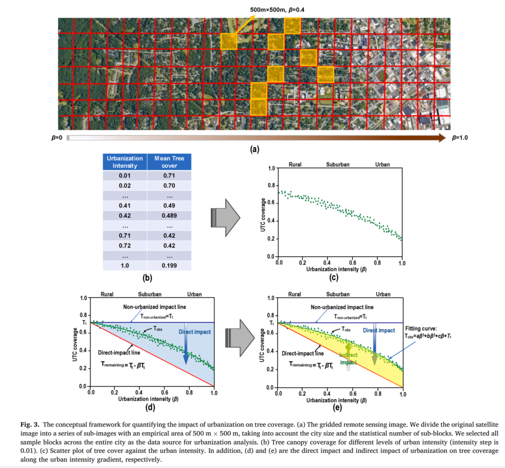
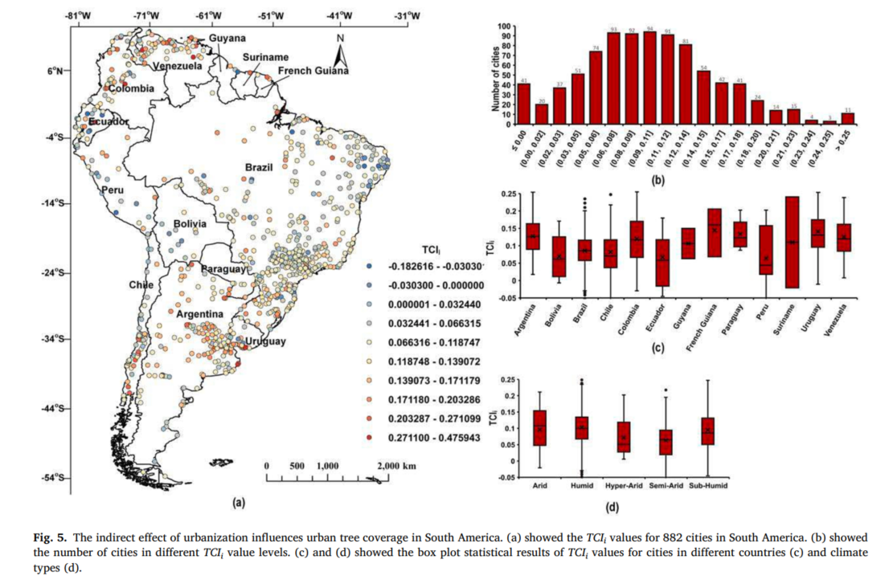

# Indirect-impact-of-urbanization
 High-resolution satellite images reveal the prevalent positive indirect impact of urbanization on urban tree canopy coverage in South America


This is the source data for our paper: [High-resolution satellite images reveal the prevalent positive indirect impact of urbanization on urban tree canopy coverage in South America](https://www.sciencedirect.com/science/article/pii/S0169204624000756).

This study revealed the negative direct impacts and prevalent positive indirect impacts of urbanization on UTC coverage. In South America, 841 cities exhibit positive indirect impacts, while only 41 cities show negative indirect impacts. The prevalent positive indirect effects can offset approximately 48% of the direct loss of tree coverage due to increased urban intensity, with full offsets achieved in Argentinian and arid regions of South America. In addition, human activity factors play the most important role in determining the indirect effects of urbanization on UTC coverage, followed by climatic and geographic factors. These findings will help us understand the impact of urbanization on UTC coverage along the urban intensity gradient and formulate policies and strategies to promote sustainable urban development in South America.

The original fine-scale tree canopy products for 882 cities in South America are freely available to the community ([TreeSegment_SA](https://github.com/nkszjx/TreeSegment_SA)). 




## Citation

```
@article{guo2024high,
  title={High-resolution satellite images reveal the prevalent positive indirect impact of urbanization on urban tree canopy coverage in South America},
  author={Guo, Jianhua and Hong, Danfeng and Zhu, Xiao Xiang},
  journal={Landscape and Urban Planning},
  volume={247},
  pages={105076},
  year={2024},
  publisher={Elsevier}
}
```
